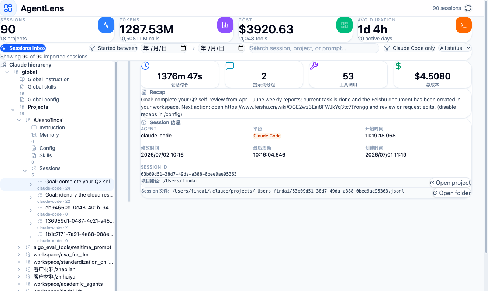
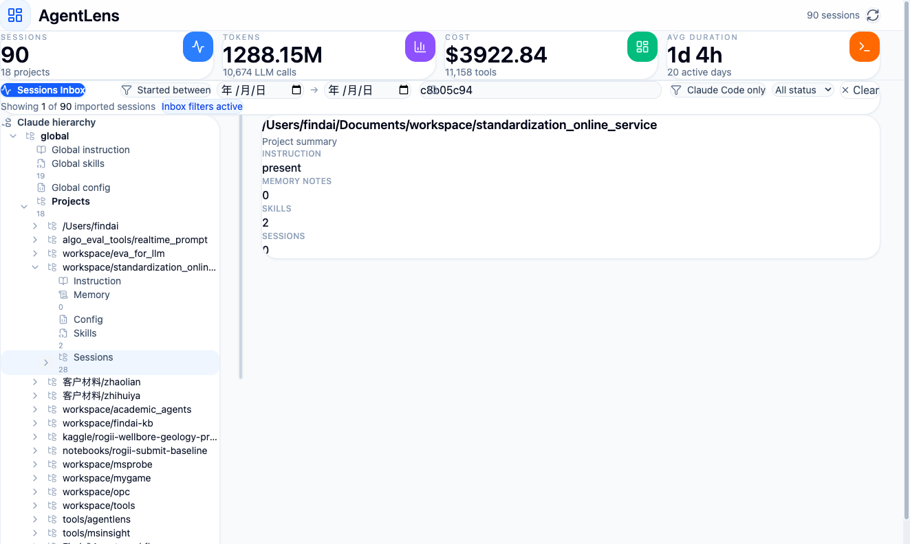
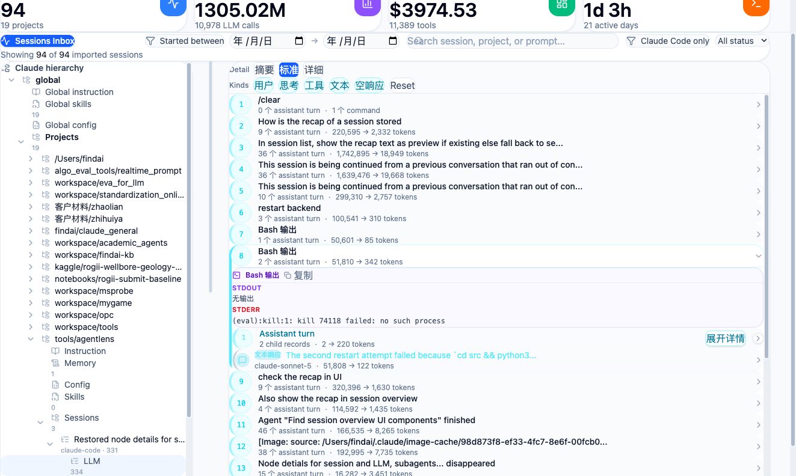
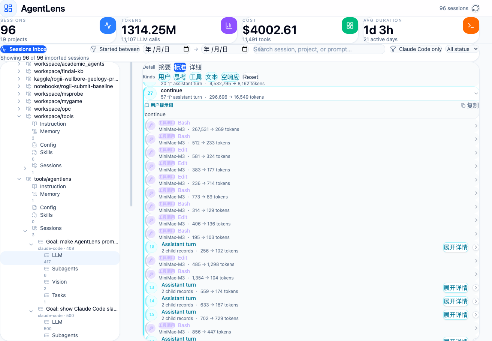
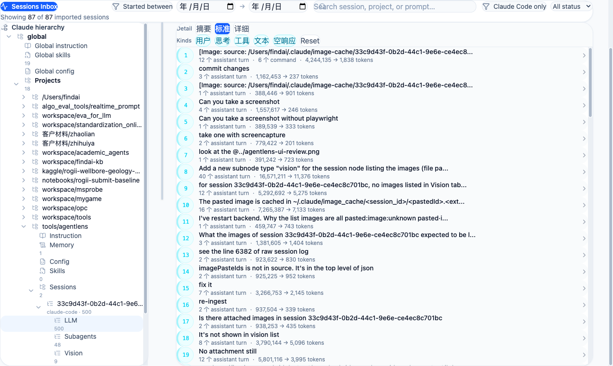

# AgentLens

> **Local-first session intelligence for Claude Code.**

AgentLens reads your local `~/.claude/projects/.../*.jsonl` session logs, normalizes them into structured session records, stores them in SQLite, and serves a searchable inbox, a hierarchy explorer, and a per-session inspector from a FastAPI + React dashboard.

It is **not** a remote-control platform, a hosted telemetry SaaS, or a generic OpenTelemetry backend. The product is best understood as a forensic replay and analytics layer for the Claude Code history that already exists on your machine.

---

## Table of contents

- [Highlights](#highlights)
- [Screenshots](#screenshots)
- [How it works](#how-it-works)
- [Requirements](#requirements)
- [Install](#install)
- [Run](#run)
- [Configuration](#configuration)
- [Project layout](#project-layout)
- [HTTP API](#http-api)
- [Development](#development)
- [Troubleshooting](#troubleshooting)
- [Contributing](#contributing)
- [License](#license)

---

## Highlights

- **Hierarchy explorer.** Browse global → projects → sessions → subagents/llm/vision/tasks. Recap text drives the session labels so the most recent intent is always visible.
- **Session inspector with Recap card.** Every session surfaces an `away_summary` recap, prompt-thread list, tool calls, subagent activity, and provenance (project path + source JSONL).
- **Structured control-plane cards.** `<task-notification>`, `<bash-stdout>`, `<bash-stderr>`, `<bash-input>`, `<bash-output>`, and `<bash-exit-code>` wrappers are decoded into typed UI cards with explicit `无输出` / `无错误输出` / `不完整` badges.
- **Slash commands as first-class prompt threads.** `/loop`, `/clear`, `/model`, `/compact` and friends are preserved with their `command-name` / `command-args` / `command-message` fields and rendered as standalone rows. `/loop` dedupes across its `isMeta: true` skill expansion.
- **Lightweight hierarchy projection.** Lazy `/api/v1/hierarchy` + `/api/v1/hierarchy/children` keep the inbox responsive on long sessions.
- **Project metadata panel.** CLAUDE.md instructions, `MEMORY.md` index, local `.claude/settings.local.json` permissions, git worktrees, and counts of session/subagent/task artifacts.
- **Date-range filter** on sessions, overview stats, and project rollups.
- **Local-first, no cloud dependency.** SQLite at `~/.agentlens/agentlens.db`; no third-party services required.

See [`FEATURES.md`](FEATURES.md) for the full list and [`CHANGELOG.md`](CHANGELOG.md) for release-by-release notes.

---

## Screenshots

**Session overview with the Recap card and provenance.**



**Hierarchy explorer with sessions bucketed under each project.**



**Per-session LLM prompt-thread list with control-plane cards.**



**Prompt-thread detail with tool calls and assistant turns.**



**LLM node with prompt-thread counts and assistant-turn summarization.**



---

## How it works

```text
Claude Code session logs (JSONL)
        │
        ▼
CollectorManager + Claude Code collector
        │  historical backfill + watch mode
        ▼
SessionAggregator (collectors.py)
        │  parse messages, attach tools, attach subagents,
        │  collect vision references, capture recap, model commands
        ▼
SQLiteStorage (storage.py)
        │  session projection + traces-compatible persistence
        ▼
FastAPI (api.py)
        │  /sessions, /sessions/{id}, /stats, /hierarchy, /projects/by-path
        ▼
React dashboard (dashboard/)
        │  inbox, hierarchy, inspector, control-plane cards
        ▼
You
```

The collector is the canonical entrypoint. `src/agentlens/api.py` starts it on FastAPI startup. `session_scanner.py` is a thin CLI wrapper around the same pipeline for use as a standalone process.

---

## Requirements

- Python ≥ 3.10
- Node.js ≥ 18 (for the dashboard)
- A populated `~/.claude/projects/` directory (i.e. you have used Claude Code locally)

Optional:

- `xdg-open` (Linux), `open` (macOS), or `startfile` (Windows) for the "Open project" / "Open folder" actions.

---

## Install

```bash
git clone https://github.com/QJ-Chen/agentlen.git
cd agentlen

# backend
pip install -e .

# frontend
cd dashboard
npm install
cd ..
```

On Windows, use PowerShell or CMD as needed. `python` or `py -3` may be available instead of `python3`.

---

## Run

Three processes make up the local dev workflow. They can each run in their own terminal.

```bash
# 1. backend (auto-backfills local Claude Code sessions on startup, then watches)
python3 -m src.agentlens.api

# 2. dashboard (Vite dev server with HMR)
cd dashboard
npm run dev
# prints a URL like http://localhost:5173
```

The backend listens on `http://localhost:8080`. The dashboard reads `API_URL = 'http://localhost:8080'` by default — see [Configuration](#configuration) to point it elsewhere.

To run a dedicated local scanner (for example, on a machine that does not run the API):

```bash
python3 session_scanner.py --watch --interval 5
```

### Sanity check

```bash
curl -s http://localhost:8080/api/v1/sessions | python3 -m json.tool | head
```

You should see Claude Code sessions indexed from `~/.claude/projects/...`.

---

## Configuration

| Env var | Default | Purpose |
| --- | --- | --- |
| `AGENTLENS_API_URL` | `http://localhost:8080` | Frontend API base URL. Edit `dashboard/src/App.tsx` `API_URL` if you change it for the dev server. |
| `AGENTLENS_DB_PATH` | `~/.agentlens/agentlens.db` | SQLite database file. Set this if you want the DB to live outside your home directory. |
| `AGENTLENS_LOG_LEVEL` | `INFO` | Standard Python logging level. |

The backend port (8080) is hardcoded in `src/agentlens/api.py`. Frontend `dashboard/src/App.tsx` mirrors it via `API_URL`. If you change one, change the other.

---

## Project layout

```text
agentlen/
├── src/agentlens/
│   ├── api.py                # FastAPI backend
│   ├── storage.py            # SQLite persistence + query helpers
│   ├── collectors.py         # Claude Code ingestion pipeline
│   ├── realtime.py           # background collector watch
│   └── ...
├── dashboard/
│   └── src/
│       ├── main.tsx          # mounts App
│       ├── App.tsx           # dashboard shell
│       ├── components/       # HierarchyTree, NodeDetailPane, EnhancedTraceDetail, ...
│       └── lib/              # sessionUtils, conversationModel, sessionNormalization, ...
├── session_scanner.py        # CLI around CollectorManager
├── docs/
│   ├── architecture.md
│   ├── session-log-formats.md
│   └── PLATFORM_LOGS.md
├── tests/
└── pyproject.toml
```

---

## HTTP API

Base URL: `http://localhost:8080`.

### Sessions

- `GET /api/v1/sessions` — list sessions, with `start_time`, `end_time`, `period_hours`, `limit`, `status`, and free-text search parameters.
- `GET /api/v1/sessions/{session_id}` — full session record (prompt threads, tool calls, LLM calls, subagent logs, tasks, vision, recap).

### Stats

- `GET /api/v1/stats/overview` — totals, model mix, status counts, top tools, active days. Supports `start_time`, `end_time`, `period_hours`.
- `GET /api/v1/stats/projects` — project rollups. Same date-range parameters.

### Hierarchy

- `GET /api/v1/hierarchy` — lightweight root (no detail payload).
- `GET /api/v1/hierarchy/children` — children for a given `node_id`. Opens a session / project lazily.

### Project metadata

- `GET /api/v1/projects/by-path?project_path=...` — CLAUDE.md instructions, memory index, local config, worktrees, session/task artifact counts.

### Ingestion

- `POST /api/v1/ingest/rescan` — request a manual rescan.
- `GET /api/v1/ingest/status` — current job state and per-collector health.

### Session actions

- `POST /api/v1/sessions/{session_id}/open?target=project|session_folder` — open the project or session folder in the OS file manager.

### Compatibility

- `POST /api/v1/traces` and `POST /api/v1/traces/batch` remain available for Claude Code-shaped payloads. They are not the primary product path.

Full schema is best discovered via OpenAPI: `GET /openapi.json`.

---

## Development

```bash
# backend
pytest
pytest tests/test_collectors.py::test_loop_command_threads_attach_through_meta_expansion
ruff check .
mypy

# frontend
cd dashboard
npm run lint
npm run build
npm run preview
```

Recommended workflow:

1. Open a branch off `main`.
2. Make the change.
3. Run the targeted test (e.g. `pytest tests/test_collectors.py -k loop`).
4. Run the full lint + test sweep before pushing.
5. Reference the affected module in your commit body.

If you change backend models, verify both `tests/test_api.py` and `tests/test_collectors.py` still pass — the API uses a `RangeCaptureStorage` test double so date-range additions are usually covered with a small new test.

---

## Troubleshooting

- **"Path does not exist" from `/api/v1/sessions/{id}/open`** — the session's `session_file_path` no longer points to a real file. Run a rescan (`POST /api/v1/ingest/rescan`) to repopulate provenance.
- **Inbox shows 0 sessions but `~/.claude/projects/` has data** — confirm the backend is on port 8080 and that the Vite dev server `API_URL` matches. Check `~/.agentlens/agentlens.db` mtime.
- **`<task-notification>` shows as `不完整`** — the collector truncates `last_user_prompt` to 500 chars, so a long task notification may have its closing tag clipped. The parser tolerates this and marks the block as incomplete. This is by design.
- **Hierarchies are slow on huge sessions** — confirm `SQLiteStorage` is using the lightweight projection table. Re-run the migration by deleting `~/.agentlens/agentlens.db` and restarting the backend (it will re-ingest from local logs).
- **Watcher misses new sessions** — confirm the backend is still running (`GET /api/v1/ingest/status` should report `watching: true`). Restart if it died.

---

## Contributing

Issues and pull requests are welcome. Useful entrypoints for newcomers:

- `src/agentlens/collectors.py` — Claude Code log parsing.
- `src/agentlens/storage.py` — SQLite schema and query helpers.
- `dashboard/src/lib/sessionUtils.ts` — text and control-plane parsing for the UI.
- `dashboard/src/components/EnhancedTraceDetail.tsx` — session inspector.
- `dashboard/src/components/HierarchyTree.tsx` + `NodeDetailPane.tsx` — hierarchy surfaces.

When changing backend models, add or update the matching test in `tests/`. When changing the UI, add or update the `dashboard/src/lib/conversationModel.ts` snapshot tests if they apply to your change.

---

## License

[MIT](LICENSE)
